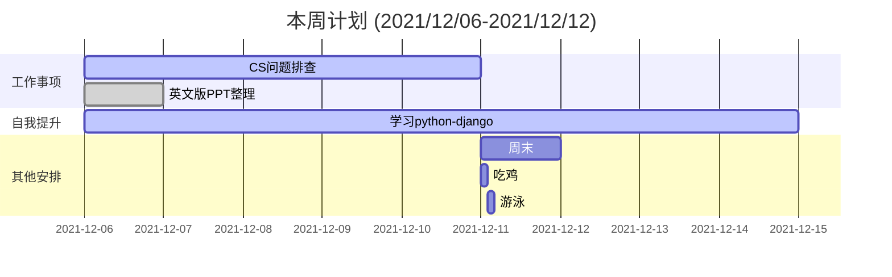

    
工作日报，要写详细点

    <pre>
    	
    	1.具体解决了什么问题，如何解决的，联系了哪些人，结论是什么？有什么收获。
		2.工作日报可以作为经验教训，可查证。
		3.不能在采用teambition以往的方式进行。
    	4.如要记录其他事情，以事项的形式进行
		5.每天一则，可以把任何事情都列为工作
		6.每周末进行总结（周报）并归档
		7.每月进行总结（月报）
		8.主要以事项为主，若有想法或者情绪，可通过括号备注的方式
		9.简洁明了，每项不超过20字
		10.每日总结问题点，工作上的，沟通上的，可以优化的点
		11.真实有效，即便是与人聊天，发呆也要如实记录，方便统计时间的花销
		
	</pre>

    
本周计划 (2021/12/06-2021/12/12)

    <pre>
    1.	PPT英文版整理；
    2.	CS问题排查(日常)；
    3.	
    </pre>

    
2021-12-10周例会 周五

    <pre>
    
L2小组：

    	1.	CS问题；
    	2.	监控治理：
			监控周报、包括Digger等的治理；
    		周报的目的：统计总的项、突出有问题的项，如AVG>5000的接口数；
    		对内展现成果、对外展现问题；
    		日志规范；
    	3.	问题点：
    		CS问题对比图：两个历史的去掉，咨询数、转IM数、处理数三个指标按4周来展示
    	4.	SGM参数配置了解清楚；
    
环境小组：

    	1.	日常事项：代码版本的部署，环境差异对比；
    	2.	系统清单、系统表，对应负责人更新；
    </pre>

    
第49周-每日简报

    <pre>
BH490186 工作简报
    1.日常工作
        1.1	CS问题全览，查看记录所有问题;
        1.2	CS问题处理 5个;
        1.3	修改ppt英文版;
    2.其他安排：	
        2.1	
    3.改进意见：
        3.1	
 BH490287 工作简报
    1.日常工作
        1.1	发出ppt英文版;
        1.2	CS问题排查（未注册用户收到短信、收不到OTP验证码）;
        1.3	更新历史CS问题状态;
    2.其他安排：	
        2.1	
    3.改进意见：
        3.1	被情绪干扰的一天，下午的时候竟然把邮件一个地方写错了;
        3.2	产生情绪是因为总是对不齐，另外做的事情太单调，好像大家都不懂优化一样;
 BH490388 工作简报
	1.日常工作
        1.1	整理邮件分类；
        1.2	统计开户用户数据；
        1.3	回复1+8用户的生产问题；
    2.其他安排：	
        2.1	
    3.改进意见：
        3.1	怎么感觉越来越没意思了，想混是ok的，但是我不想，我想有所为
        3.2	耗费精力，不加班，回家充电
 BH490489 工作简报
	1.日常工作
        1.1	统计排除CS问题；
        1.2	协助整理周报数据；
        1.3	加班排查CS问题（23：00）；
    2.其他安排：	
        2.1	
    3.改进意见：
        3.1	效率低、应该是找到每个人最擅长的事，提升整体效率；
 BH490590 工作简报
	1.日常工作
        1.1	统计排除CS问题（手机越狱、核心批扣慢导致付款失败）；
        1.2	SGM相关指标的统计与理解（试图找到邮件发出的根据）；
        1.3	用户中心变更验证及工单跟进；
    2.其他安排：	
        2.1	
    3.改进意见：
        3.1	
 BH490691M 工作简报（加班）
	今日计划：技术栈技术栈（现在的工作太枯燥了）、看书看书（技术类、提升类）、总结总结（优化流程、总结提升）
	1.日常工作
        1.1	联系tutuka，咨询为输入3DS但交易成功的问题；
        1.2	跟进查看不了月结单的问题，los接口App013的filestream为空；
        1.3	整理并发出SGM指标介绍ppt；
        1.4	yuu积分问题排查（晚上刚要走）；
    2.其他安排：	
        2.1	购买阿里云服务器，资源迁移；
    3.改进意见：
        3.1	一个团队，要清醒才可以，至少要有一个人清醒
 BH490792M 工作简报
	1.日常工作
        1.1	
    2.其他安排：	
        2.1	服务器资源迁移；
        2.2	游泳(第1，昨晚不应该熬夜打游戏；第2，中午应该吃些更有营养的食物，而不是只吃一个汉堡)；
        2.3	见了一位友人，没想到，一年了，她会找我；
    3.改进意见：
        3.1	游泳需要体力，所以前期准备也很重要；
</pre>

    
本周总结 (2021/12/06-2021/12/12)

    <pre>
    一、本周工作回顾
		1)	编写小组介绍英文版PPT、SGM指标介绍PPT；
		2)	排查记录CS问题；
		3)	整理邮件、统计看板数据；
	二、下周工作计划
		1)	暂不写
	三、意见与建议
		1)	想好未来规划；
		2)	要提升的是什么，要成为的是什么；
	</pre>

