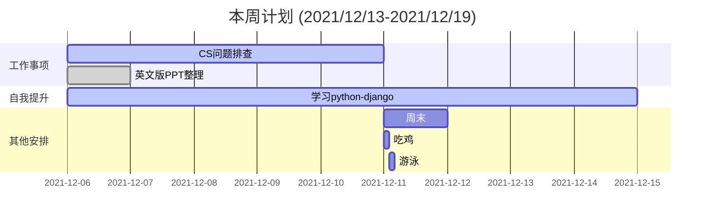

    
工作日报，要写详细点

    <pre>
    	
    	1.具体解决了什么问题，如何解决的，联系了哪些人，结论是什么？有什么收获。
		2.工作日报可以作为经验教训，可查证。
		3.不能在采用teambition以往的方式进行。
    	4.如要记录其他事情，以事项的形式进行
		5.每天一则，可以把任何事情都列为工作
		6.每周末进行总结（周报）并归档
		7.每月进行总结（月报）
		8.主要以事项为主，若有想法或者情绪，可通过括号备注的方式
		9.简洁明了，每项不超过20字
		10.每日总结问题点，工作上的，沟通上的，可以优化的点
		11.真实有效，即便是与人聊天，发呆也要如实记录，方便统计时间的花销
		
	</pre>

    
2021-12-17周例会 周五

    <pre>
    
L2小组：

    	1.	CS问题：yuu、还款问题、digsign体验不好，开户难；
    	2.	用一页PPT说明客户咨询及投诉的十大问题；
    	3.	单核CPU100%报警的问题；
    	4.	数据统计的事情，单独的会说一下就好了；做一次PPT，以后每周修改数据；
    	5.	问题多的系统分布，是否系统有可以改进的地方；
    	6.	SGM材料准备好，与运维在会议上对齐，然后修改配置；
    	7.	L2的jira空间，已经完成；
    
环境小组：

    	1.	无上线事项；
    	2.	日常：UAT账户授权、代码扫描，2.0sprint3部署，加一个总未关闭数；
    	3.	任务是建在jira上的；
    </pre>

    
第50周-每日简报

    <pre>
BH500193 工作简报
	0.今日计划：
        0.1	跟踪今日新增及历史CS问题；
        0.2	更新SGM指标介绍PPT；
	1.日常工作
        1.1	跟踪今日18个CS问题；
        1.2	排查yuu积分、月结单、支付收不到3DS验证码等问题；
        1.3	跟进回复历史问题；
        1.4	采集生产环境指标、修改SGM指标介绍PPT(加班事项);
    2.其他安排：	
        2.1	
    3.改进意见：
        3.1	晚上加班效率特别低、保证效率
 BH500294 工作简报
	0.今日计划：
        0.1	发出SGM指标介绍PPT1.0
        0.2	邮件数据模板优化
	1.日常工作
        1.1	更新IM问题及统计；
        1.2	整理外发邮件(tutuka/中移动)数据模板；
        1.3	优化PPT1.0并同Team与领导讲解；
        1.4	跟踪今日CS问题及历史CS问题回复；
    2.其他安排：	
        2.1	
    3.改进意见：
        3.1	
 BH500395 工作简报
	0.今日计划：
        0.1	跟进、更新CS问题处理情况；
        0.2	更新一版PPT
        0.3	测试邮件的参数报警机制
	1.日常工作
        1.1	跟进历史CS问题，处理新增问题；
        1.2	分析本月新增用户趋势，预测年度L3用户总数；
        1.3	回复CS问题(加班事项)；
        1.4	修改PPT并发送(加班事项)；
    2.其他安排：	
        2.1	
    3.改进意见：
        3.1	
 BH500496 工作简报
	0.今日计划：
        0.1	SGM监控指标PPT修改；
        0.2	生产问题查看；
        0.3	周报数据统计；
        0.4	分享会数据整理；
	1.日常工作
        1.1	完成SGM监控指标介绍PPT修改；
        1.2	统计周报及核心数据收集；
        1.3	周四会议的数据分享整理，待改进；
    2.其他安排：	
        2.1	
    3.改进意见：
        3.1	
 BH500597 工作简报
	0.今日计划：
        0.1	
	1.日常工作
        1.1	完成了PPT的初版最后一次修改；
        1.2	生产问题同步跟进了一下；
    2.其他安排：	
        2.1	
    3.改进意见：
        3.1	超级没有状态的一天，前面连续两天加到10.30以后，很累；
        3.2	注意调节，如何提高白天效率；
 BH500698M 工作简报（加班）
	0.今日计划：
        0.1	
	1.日常工作
        1.1	晨跑5公里；
        1.2	看电影
        1.3	约老同学；
        1.4	打游戏；
    2.其他安排：	
        2.1	
    3.改进意见：
        3.1	
 BH500799M 工作简报
	0.今日计划：
        0.1	
	1.日常工作
        1.1	爬山；
        1.2	约饭；
    2.其他安排：	
        2.1	
    3.改进意见：
        3.1	
</pre>

    
本周总结 (2021/12/13-2021/12/129summary>
    <pre>
    一、本周工作回顾
		1)
	二、下周工作计划
		1)	暂不写
	三、意见与建议
		1)
	</pre>

