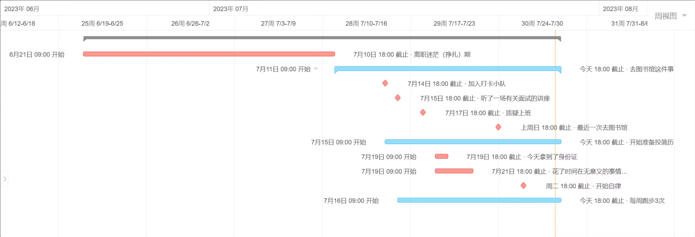

迁移自：https://www.notion.so/2023-07-2269214b64494f6ebf9bdaf48d91602e

大家好，今天是7月28号，按照计划每月最后一周的星期五是月末复盘日。本月的复盘有点奇怪，因为可能时间需要延伸到6月末。

众所周知，23年这个6月将是一个不平凡的6月，因为在这个月底，一大部分人被辞退了，我也不例外，而且通过这一个月以来，理想的工作也不是那么好找，许多同事跟我一样，截止目前还是处于待业状态。

我把时间分成了两个阶段来说，**6月21日（离场那天）-7月10日**以及**7月11日-7月28日（今天）**，两个阶段代表了不同的状态。

------

### 一、第一阶段

第一个阶段我愿意将其命名为离职迷茫期（或者叫挣扎期），因为在很长一段时间里，从突然的高强度工作压力之下解放出来，竟然莫名有点不习惯，没有办法认真地计划每一天，觉得不管怎么过都是在浪费时间，我突然想到这肯定就是工作所形成的思维定势，因为在工作之中，我不会有不知道每天要干什么的情况，很多时候都是工作推动着人，似乎不太需要过多的思考今天到底要干什么，因为事情就摆在那里等着你去做，偶尔的周末休息还会觉得比工作更累，因为在空窗期要规划自己的完整的一天，而且还要有意义地过完，实在是太不容易了。

工作的时候每天都很紧绷，但是现在不会了。因为可以“摆烂”，只要不焦虑，就可以摆得理所当然，所以与以往不同，我也第一时间把失业的消息告诉了亲朋好友。但是有一点必须给他们澄清，广而告之不是为了倒过来给我徒增焦虑，所以在这件事情上，我觉得做得算对，虽然也有一点点不一样的声音，但是我突然想反问一个问题：只要有上班就是对的吗？仅仅有班上在某种程度上来说，是不是也算是一种逃避？逃避别人的眼光（所有人都认为不上班就不正常）、逃避自己的焦虑（有的人认为只要上了班就没有那么焦虑了，是吗？我更愿意称之为“***工作陷阱***”）。

在我看来，有两种人需要着急上班，一是刚毕业没什么积蓄的同学，刚进入谈什么理想呢，先把自己养活再说吧；第二种是月光族，同样也是生活所迫，实在不济就只有逃离大城市另谋出路了。（应该还有一种：车房贷压力。总之就是经济压力）

如果不想想清楚，没有意识的上班会不会也像以前一样，行尸走肉般陷入工作的怪圈，大量的时间花在通勤，花在无聊的会议，花在低效率上，把自己几乎所有的时间都无私奉献给了亲爱的工作却依然让自己入不敷出、焦头烂额，自己所做的工作又是不是和当前的技能、能力相匹配，又或者是不是对自己期望过高或者过低，有工作的时候，这些现实面的问题基本上是懒得想，因为干一天活（或者叫混一天）就有一天的工资，那就先“混”着呗，一年两年、三年四年，如果认真总结起来，或者重新书写一遍履历才发现，原来没什么好写的，自己的经历是那么普普通通，只怪平时也很少归纳总结，结果就是一两年的工作经验干了好多年，这样的结果在今天这个时代怎么去和别人卷。那么反过来，只要做出一点点改变，你就会把一大批人甩在身后。

再回到第一个阶段的实际情况，之所以迷茫或者挣扎，从前期的笔记就可以看出，有时候会输出一些凌散的计划，突如其来的感想，想跨大步但是又达不到目的的那种失落，说到底就是那段时间还没有真正的审视过自己。

很长一段时间里，都在进行以往的习惯复制，无限放纵自己熬夜、刷剧、泡在虚拟世界以寻求所谓的慰藉，但是往往事与愿违，越来越迷茫，甚至出现抑郁，越来越找不到生活和工作的意义，回过头来看（或者叫审视），无非就是被空虚、寂寞占满，迷了心智，浪费了大量本可以做点什么的时间而已。

找找职业相关的工具，如Devops相关，但是与实际的经验相差甚远，当然会焦虑，这属于期望过高。那段时间，你说“**白天根本静不下来，晚上又有负罪感**”，不就是真实体现吗？

零星的计划，计划出去看看，可是严重感冒了一个礼拜，这个念头也暂时打住了。也想着是不是可以换一个城市，但或者去哪里生活可能并没有那么重要，有喜欢的事、爱的人，可能才是真正的源动力所在。

当时就是一个字“宅”，宅在家，哪里也没去，甚至害怕见人、害怕别人问起。当时就是告诉自己要鼓起勇气出去走走，白天少待在家里（因为那段时间并没有多么自律），现在是空闲时间，如果不思考、等到真正工作的时候何尝不是从一个泥潭拔出来又接着陷入另一个泥潭呢。 你曾感悟：现在（指当时）才发现，原来不上班之后都不会思考，说明之前上班就已经停止了思考。上班的时候就已经停止了思考（这里指工作之外的任何事的思考都没有了），想想是多么可怕的一件事。

这个阶段居然还养成了拖延的习惯，做事又逐渐失去耐心。我问自己“能不能花完整的两个小时来看一部电影，还是说这点耐心都没有了？为什么要让没有工作的时候比上班还是累？”当时就是整个晚上不想睡、早上不想起，现在看来这个状态是多么的可笑和可怕。洗碗拖延、晒衣服拖延、计划也拖延。这些都会打击到你的信心。

怎么办呢？慢慢的，开始摸索，运动吧，你说“**唯有运动才能使自己强大、百试不爽**”，现在开始自律的我看来，这句话的含金量很高。想太多不如实际行动，没事可干？不如运动起来吧。

关于效率问题，还制定了一些小tips：

> 晚上特别困的那个点就先睡一觉，后面再起来做事也是可以的，怎样高效怎样来可能更好一点，那么在实际工作中应该如何改进和应用呢？我想后面在图书馆的经历会告诉你答案。

> 该吃饭吃饭、该提升提升，想这么多干什么。说到底还是焦虑惹的祸。

不知道干什么的时候也会有一些很宽泛的规划：

1. 多看书籍（技术类、文学类、经济、历史等）；
2. 少打游戏（尽量不要待在家里，一定一定要走出去工作或者学习，一种情况可以待在家里，就是给自己放假，**其实现在要再补充一种情况，那就是当自己足够自律**）；
3. 健身（一直希望有一身肌肉、也需要逐步付诸实践，包括饮食等）；运动可以减少焦虑的一部分原因就是消耗了自身能量，不让你有多余的精力空想 —— 待规划
4. 不可能没事可干（熟悉系统架构、了解开源架构、看电子书、git源码、官方文档如Django、写代码），只要有规划的行动起来就可以减少焦虑。

怎么定位自己，或者说成为更好的人，可以有一些方向来作为参考：

1、实现财务自由、周游世界 —— 想想就很棒

2、精通各种乐器，爱好广泛 —— 多才多艺

3、家境优渥，见多识广、出国留学 —— 先天条件改变不了，就后天创造了

4、帅气迷人，气质出众，热爱运动 —— 这条适合大多数男生，自信就是其中一种法宝

所谓“蜕变”，就是把自己不切实际的**白日梦**逐个击碎，然后再生出新的梦想。是的，预期过高其实就是一种白日梦，及时调整。

幽默其实也是很重要的，“桃花坞”可能是我追过最值得的节目了。

> 王传君：把每一天都当成末日去输出。

> 徐志胜：人生就是这样，有峰值、有低谷，当你在低谷开始胡思乱想的时候，想到第一层就停止，不要再继续往下想。

但是这段迷茫挣扎期可以在你以后的日子里给你一些启示。

------

### 二、第二阶段

似乎是觉得前面的日子疯够了，生活应该回归正常，生活总得继续，还是要努力赚钱，所以**给自己定下的第一个目标就是：买车**。得有目标，才有赚钱的动力。

整理了深圳的房价指南，知道自己的差距；也自己交了社保，得对自己的事情开始上心了。

第二个阶段要说的其实就很多了，从7月11号开始，今天是第三个周。总体来说，这三个周一直在进步是大家有目共睹的。下面按周来叙述吧。

**第一周：开始出门，再也不待在家里了。**

周二开始往图书馆跑的，因为周一闭馆。前面两三天基本上就是各个楼层熟悉，到处找座位，感受集体学习的氛围，很多时候就是只要走出第一步，其实就好了，克服的第一个障碍就是自己。图书馆里有时候大家也随地而坐，随便找个地方就开始工作、学习，有何不可呢？

这周五，加入了一个打卡小分队，是以前的同事组织的，只能很佩服这种组织能力。坚持打开，虽然后面有点变形，而且我也不太愿意把找工作这个事情当成一个待办事项放在群里，也不是大事小事作为一个任务来规划。但是这个小小的操作对我来说算是锦上添花，只管后期养成就行了。

周六的时候，意外走到了创客空间、意外的听了一场关于面试的讲座，全程中英文输出，很享受。

**第二周：对投简历、找工作开始上心了。**

开始制定周计划（跑步、看英文电影、健身、周总结），月计划（游泳、爬山、复盘），每日习惯养成（早睡、早起、早读、睡前阅读、学英语记单词等等）。

但是不得不说这一周，受到了一些冲击，很容易受网络上一些观点的蛊惑，自己还无法做出正确判读，第二个问题是银行卡的问题严重影响了心情，现在想想明明可以置之不理的，当初只是徒增烦恼。于是开始质疑上班的意义，导致求职进度一度停滞。计划投简历也只是对来访者做了一些简单的回复，还有就是主动投出10个岗位。进度大概就是这样。还是需要主动出击，即使不成功，也不会有什么影响，说不定还能增长经验。

另外就是安排学习，刷刷python的一些面试题，做笔记。因为一些影响，整体来说，这周对于工作方面的贡献其实不算大。

最值得庆幸的是跑步3次/周的计划算是完成了。这一点绝对值得肯定和赞赏。还是一个庆幸的事情就是19号拿到了身份证，这真是省去了后续的大笔麻烦。

**第三周：变得自律起来了，规划也越来越细致、高可执行了。**

只有一种感觉，就是“**我自律，我自由**”，截止上周日最近一次去图书馆之后，这一周基本没有再去过图书馆。因为我渐渐感觉到只要能掌控自己，是完全可以屏蔽环境的影响的。改变环境，打造一个适合工作、学习的环境，包括温度、光线、适当的休息、视力调节等等都是有助于获得更高的工作效率的，而且我省去了再路上花费的时间，这又让我开始思考上班通勤的意义了。

本周的跑步计划也是圆满完成，赞。

接下来的规划：**需要对工作的事情上心，对赚钱的事情上心，做到有的放矢**，凡事想想后果，想想方法对不对。工作需要细致规划，一是调整预期（再次修改了一版简历），先有收入再谈理想；二是找工作不停止，不断打磨、精力自己的能力，不断优化自己的履历，达到对自己充满认可的程度，以及逐步达到领域专家级别。

最后，写之不易（*得有4000字左右，花了大概2-3个小时*），也祝你越来越好。对生活充满感激，对一切充满热忱。眼里有光，对世界说声：你好。

—END—